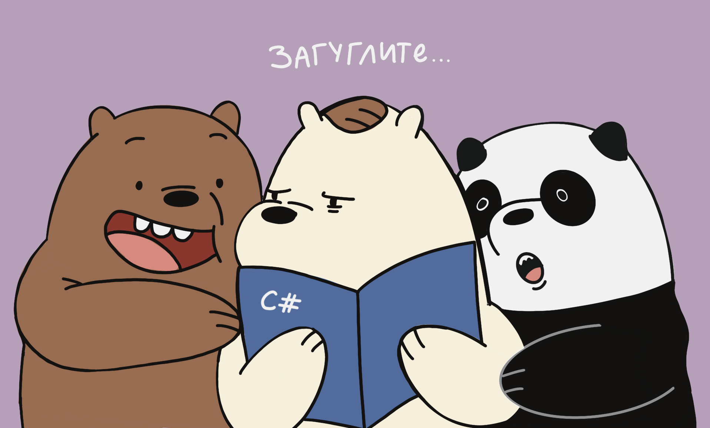

<h1 align="center">Привет всем!</a> 
</h1>
<h2 align="center"> Мы команда по разработке приложения SpecialLink</a> 
<h3 align="center">Газизова Анита, Овечкина Мария и Щербакова Виктория</h3>

В этом WPF приложении пользователи могут проверить совместимость по разным критериям.  
Возможна реализация создания тестов админами.  
Релевантность нашего проекта заключается в том, что люди очень любят проходить различного рода тесты. Подобные рубрики есть у Медузы, в различных журналах и даже есть отдельные сайты, где пользователи могут создавать и проходить разные квизы.  
В интернете множество различных тестов на совместимости, так что спрос на такой контент очевидно присутствует.  
### Наша цель — разработать различные тесты на совместимость и объединить это в одном удобном приложении.

